# TAPTOM Mobile

**ภาษา: ไทย** | [English](./README.md)


แอปพลิเคชันบริหารจัดการข้อมูลการเกษตรแบบรวมศูนย์ พัฒนาด้วย Flutter สำหรับเกษตรกรผู้ปลูกกระท่อมและเจ้าหน้าที่ผู้ตรวจรับรอง เกษตรกรเก็บบันทึก **GAP (Good Agricultural Practices)** ไว้ในที่เดียว เจ้าหน้าที่ตรวจและอนุมัติ และผลผลิตทุกล็อต **ตรวจสอบย้อนกลับ** ถึงแปลงปลูกได้ผ่าน QR Code

<p align="center">
  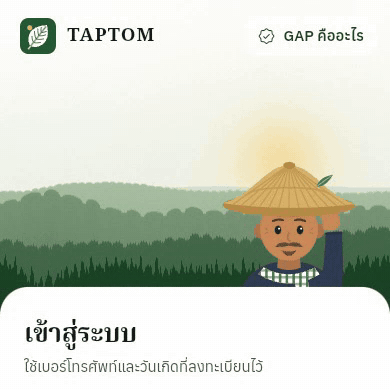
</p>

---

## ภาพหน้าจอ

### เกษตรกร

| หน้าแรก | รายละเอียดแปลง | บันทึก GAP | ฟอร์มการเก็บเกี่ยว |
| --- | --- | --- | --- |
| 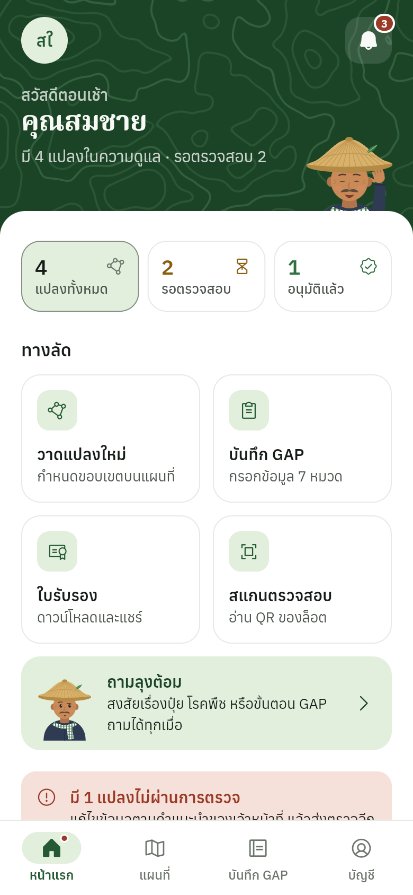 | 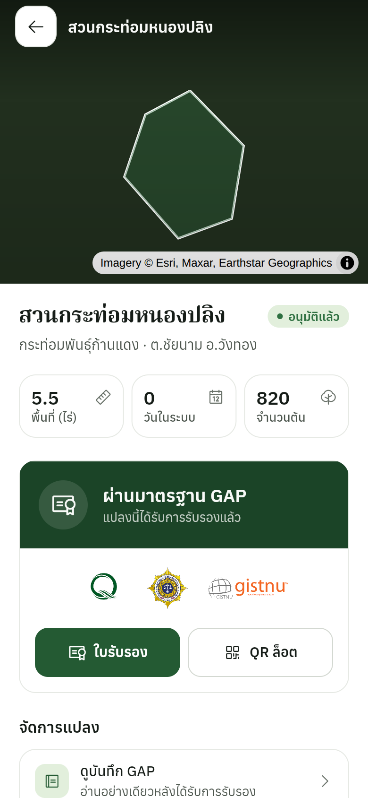 | 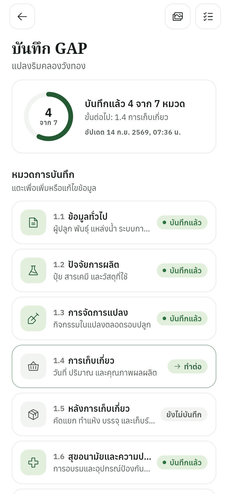 | 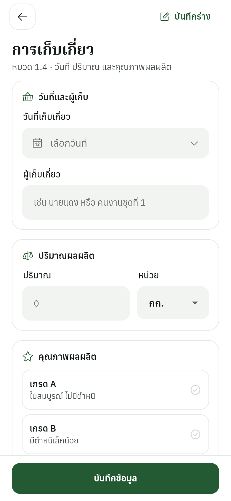 |

| แผนที่แปลงของฉัน | การแจ้งเตือน | ถามลุงต้อม | รายงานล็อตสาธารณะ |
| --- | --- | --- | --- |
| 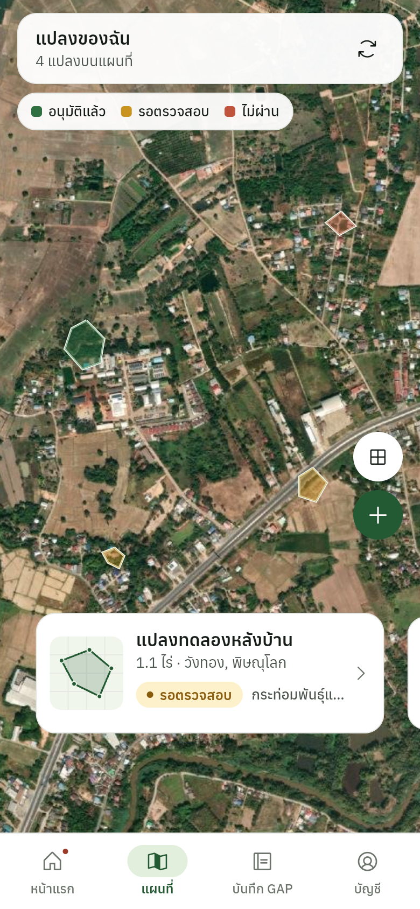 | 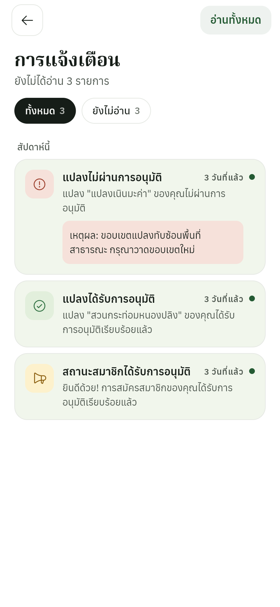 | 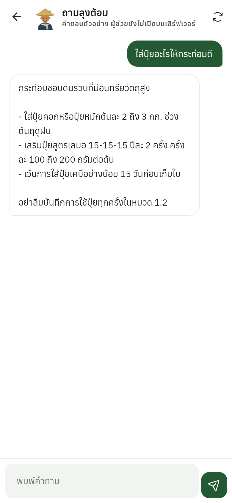 | 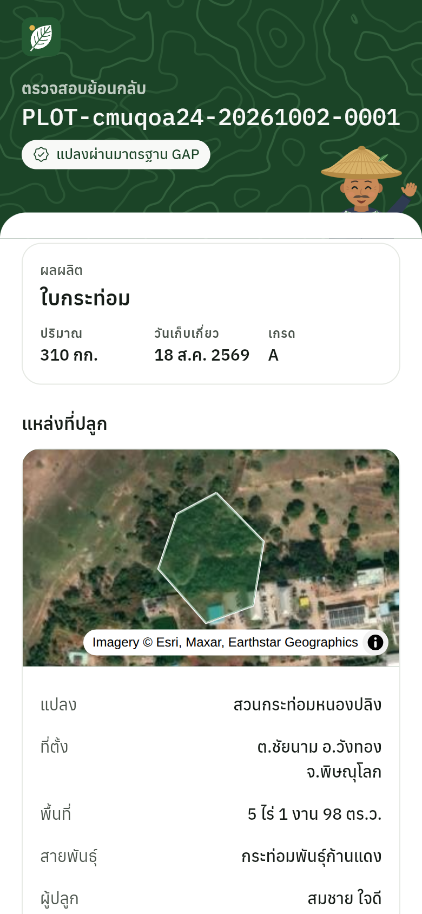 |

### เจ้าหน้าที่และผู้ดูแลระบบ

| หน้าหลักเจ้าหน้าที่ | ตรวจข้อมูล GAP | สมาชิก | แผนที่แปลง |
| --- | --- | --- | --- |
| 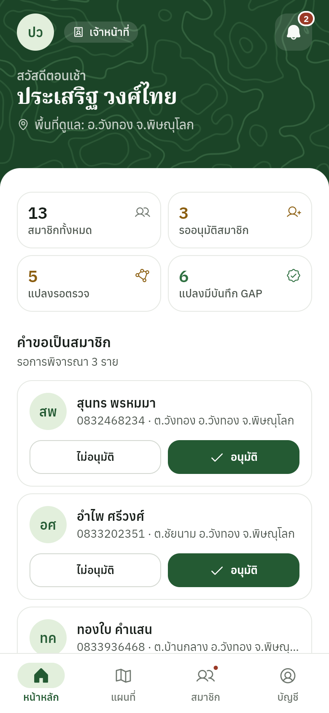 | 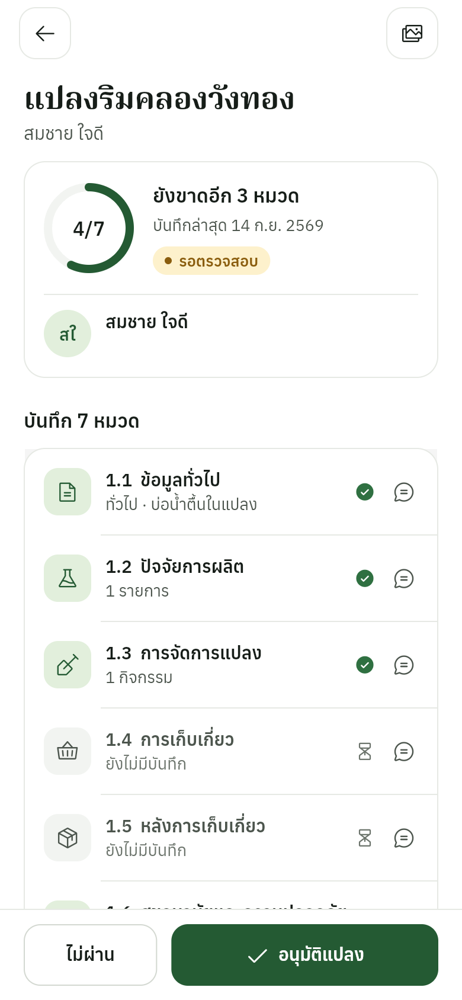 | 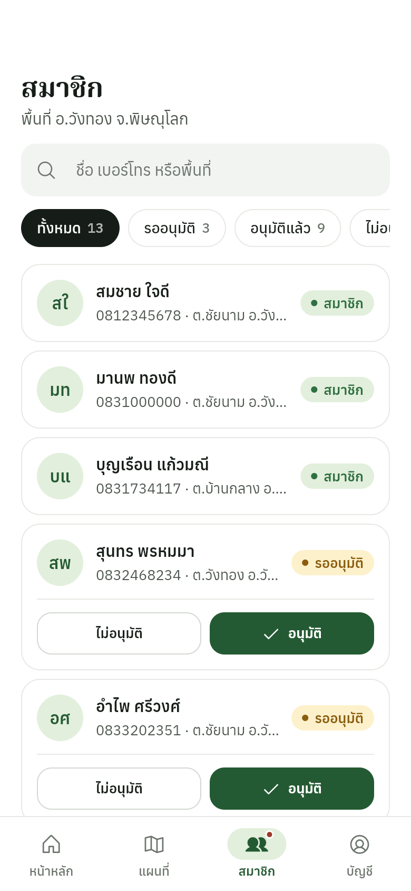 | 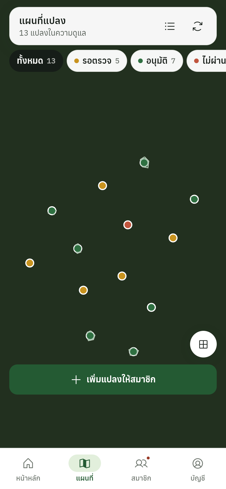 |

| ภาพรวมผู้ดูแลระบบ | การเติบโตของผู้ใช้ | เจ้าหน้าที่ | ธีมมืด |
| --- | --- | --- | --- |
| 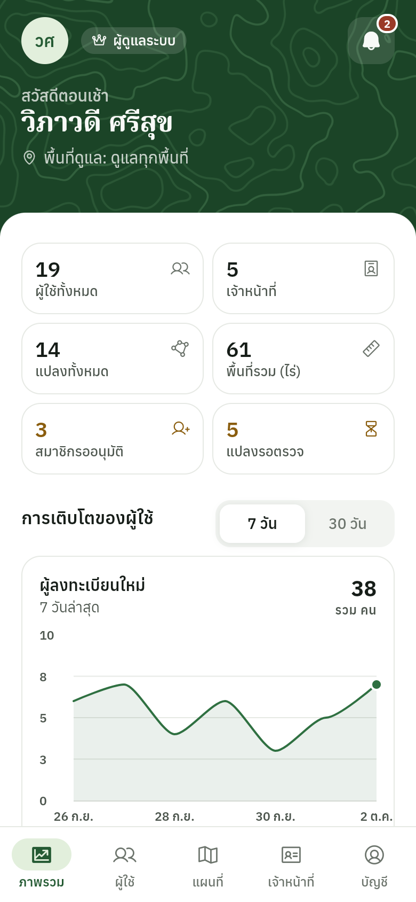 | 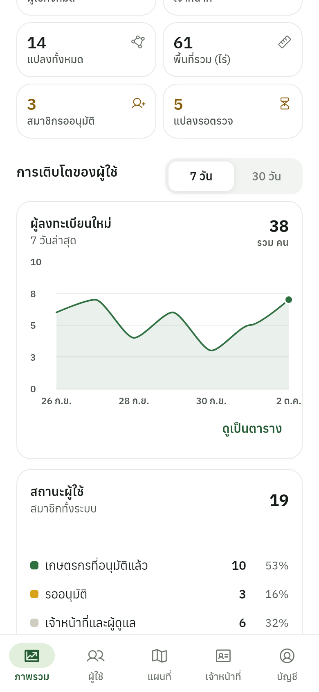 | 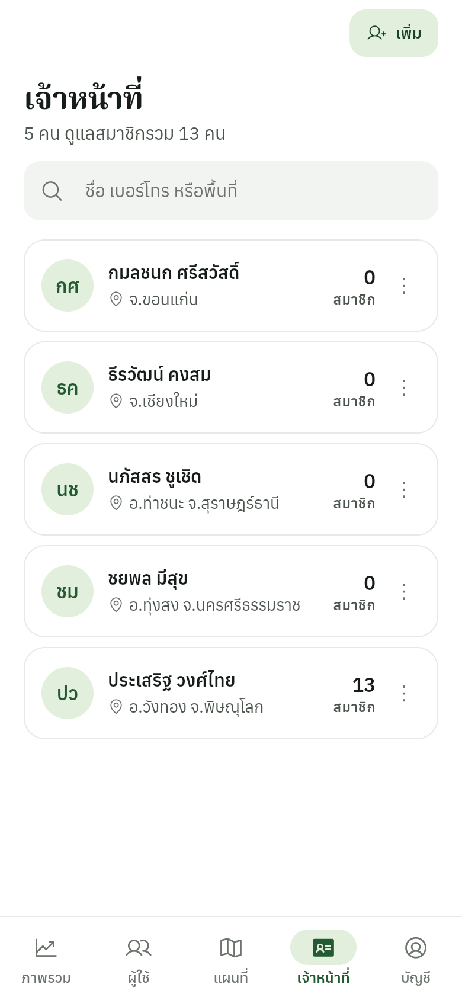 | 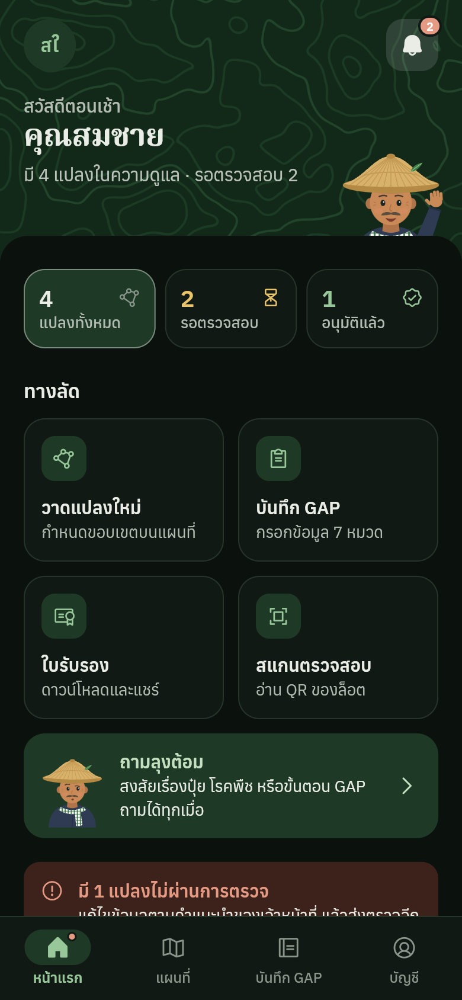 |

### แท็บเล็ตและเว็บ

บนจอกว้าง แถบเมนูด้านล่างเปลี่ยนเป็นแถบด้านข้าง และเนื้อหาจัดกึ่งกลาง

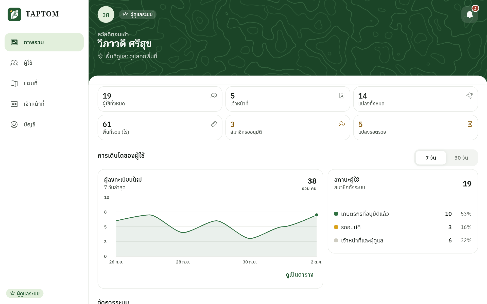

ภาพทั้งหมดสร้างจากบิลด์โหมดสาธิตด้วย `tool/screenshots` ดูรายละเอียดใน [docs/demo-mode.md](docs/demo-mode.md) ขณะถ่ายภาพไม่สามารถโหลดภาพถ่ายดาวเทียมได้ แผนที่จึงแสดงสีพื้นเรียบใต้รูปแปลง

---

## เกี่ยวกับแอปพลิเคชัน

TAPTOM Mobile คือแพลตฟอร์มข้อมูลการเกษตรที่เชื่อมเกษตรกรกับเจ้าหน้าที่ผ่านแอปเดียว แก้ปัญหาที่เกิดขึ้นจริงในภาคเกษตรไทย ได้แก่ บันทึกฟาร์มกระจัดกระจายอยู่ในสมุด ไม่มีวิธีตรวจคุณภาพที่เป็นมาตรฐานเดียวกัน และไม่สามารถตรวจสอบย้อนกลับได้ว่าผลผลิตมาจากแปลงไหน

เกษตรกรลงทะเบียนแปลงด้วยการวาดขอบเขตบนภาพถ่ายดาวเทียม บันทึกข้อมูล GAP ครบทั้ง 7 หมวด และสร้างเลขล็อตให้ผลผลิต เจ้าหน้าที่ตรวจข้อมูล อนุมัติแปลงและสมาชิก ตรวจประเมิน GAP และดูแลเกษตรกรในพื้นที่ของตน ผู้ดูแลระบบจัดการเจ้าหน้าที่และเห็นภาพรวมทั้งระบบ แต่ละบทบาทเห็นเฉพาะสิ่งที่ตนมีสิทธิ์ใช้

---

## ฟีเจอร์หลัก

### การเข้าสู่ระบบและความปลอดภัย
- เข้าสู่ระบบด้วยเบอร์โทรศัพท์และวันเกิดทุกบทบาท (ไม่ใช้รหัสผ่าน)
- ขั้นที่สองสำหรับเจ้าหน้าที่: PIN 6 หลักสำหรับเจ้าหน้าที่ 8 หลักสำหรับผู้ดูแลระบบ ตั้งเองเมื่อเข้าครั้งแรก กรอกผิด 3 ครั้งล็อก 5 นาที
- JWT Access/Refresh Token โดย refresh เพียงครั้งเดียวเมื่อได้ 401 แม้มีหลาย request รออยู่
- เก็บ Token ด้วย `FlutterSecureStorage` (EncryptedSharedPreferences บน Android) และจำผู้ใช้ล่าสุดไว้ให้เปิดแอปได้แม้ออฟไลน์

### แปลงเกษตรและแผนที่
- **MapLibre GL** บนภาพถ่ายดาวเทียม (MapTiler เมื่อมีคีย์ หรือ Esri World Imagery เมื่อไม่มี)
- ตัววาดขอบเขตแปลง ย้อนจุดได้ แสดงพื้นที่เป็นไร่ งาน ตารางวาทันที และไม่ให้บันทึกถ้าเส้นขอบตัดกัน
- แปลงทั้งหมดของเกษตรกรบนแผนที่เดียวพร้อมการ์ดเลื่อนดู เจ้าหน้าที่เห็นทุกแปลงในพื้นที่ แยกสีตามสถานะการตรวจ
- รูปถ่ายแปลงเป็นหลักฐานประกอบการตรวจ

### บันทึก GAP (7 หมวด)
- **1.1** ข้อมูลทั่วไป (การปลูก สายพันธุ์ แหล่งน้ำ ระบบให้น้ำ)
- **1.2** ปัจจัยการผลิต (ปุ๋ยและสารเคมี พร้อมข้อมูลความปลอดภัย)
- **1.3** การจัดการแปลง
- **1.4** การเก็บเกี่ยว (วันที่ ปริมาณ เกรดคุณภาพ)
- **1.5** หลังการเก็บเกี่ยว (คัดแยก ทำแห้ง บรรจุ เก็บรักษา)
- **1.6** สุขอนามัยและความปลอดภัยของผู้ปฏิบัติงาน
- **1.7** ล็อตสำหรับตรวจสอบย้อนกลับ
- แสดงความคืบหน้าของแต่ละแปลงและหมวดที่ควรทำต่อ เมื่อแปลงได้รับการรับรองแล้วบันทึกเป็นแบบอ่านอย่างเดียว
- เก็บฉบับร่างไว้ในเครื่อง (SQLite บนมือถือ) และฟอร์มข้อมูลทั่วไปบันทึกร่างอัตโนมัติ

### ตรวจสอบย้อนกลับด้วย QR (สาธารณะ)
- สแกน QR ของล็อตหรือเปิดลิงก์เพื่อดูรายงาน ไม่ต้องมีบัญชี
- แสดงเกษตรกร ที่ตั้งและขอบเขตแปลง สถานะ GAP สารเคมีที่ใช้ การเก็บเกี่ยว และการจัดการหลังเก็บเกี่ยว

### สิทธิ์ตามบทบาท
- **เกษตรกร**: แปลงของตนเอง บันทึก GAP ใบรับรอง การแจ้งเตือน และขอความช่วยเหลือ
- **เจ้าหน้าที่**: อนุมัติสมาชิกและแปลง ตรวจบันทึก GAP พร้อมส่งคำแนะนำรายหมวด วาดแปลงแทนเกษตรกร ส่งข้อความถึงเจ้าหน้าที่อื่น โดยทำได้เฉพาะแปลงในพื้นที่ที่ตนดูแล
- **ผู้ดูแลระบบ**: ทำได้ทุกอย่างเหมือนเจ้าหน้าที่ในทุกพื้นที่ เพิ่มเจ้าหน้าที่ กำหนดพื้นที่ดูแล ย้ายสมาชิกระหว่างเจ้าหน้าที่ และดูประวัติการใช้งาน
- ตัวกันเส้นทางและการตรวจพื้นที่ในแอปตรงกับกฎฝั่งเซิร์ฟเวอร์ หน้าจอจึงไม่แสดงปุ่มที่กดแล้วจะถูกปฏิเสธ

### ถามลุงต้อม
- ผู้ช่วยตอบคำถามเรื่องปุ๋ย โรคพืช และขั้นตอน GAP ถามด้วยเสียงได้
- ลุงต้อม ตัวละครชาวนาที่วาดด้วยโค้ด ทักทายตอนเข้าสู่ระบบ อยู่ในหน้าที่ยังไม่มีข้อมูล และแสดงท่าทางระหว่างผู้ช่วยคิดคำตอบ

### อื่น ๆ
- รายงานผลการตรวจ GAP และใบรับรองเป็น PDF ฝังฟอนต์ไทยและโลโก้หน่วยงานไว้ในแอป ใช้ได้แม้ออฟไลน์
- ศูนย์การแจ้งเตือน ข้อความระหว่างเจ้าหน้าที่ และระบบขอความช่วยเหลือ
- ธีมสว่างและมืด ขนาดตัวอักษร 4 ระดับ และรองรับการลดภาพเคลื่อนไหว
- ขอความยินยอม PDPA ตอนสมัครสมาชิก

---

## การออกแบบ

เวอร์ชัน 2.0 เปลี่ยนจากสีไล่ระดับและฟอนต์ที่โหลดจากเน็ต มาเป็นระบบออกแบบขนาดเล็ก:

- สีหลักสีเดียว (เขียวทุ่ง) บนพื้นขาว ใช้เหลืองอำพัน ส้มอิฐ และเทาฟ้าเฉพาะการบอกสถานะ
- Anuphan สำหรับข้อความทั่วไป Noto Serif Thai สำหรับหัวเรื่องและตัวเลข IBM Plex Mono สำหรับเบอร์โทรและเลขล็อต ฝังในแอปทั้งหมด
- GLSL fragment shader 2 ตัว: ฉากทุ่งและหญ้าไหวหลังหน้าเข้าสู่ระบบ และเส้นชั้นความสูงที่เคลื่อนช้า ๆ ในส่วนหัวของหน้าหลัก มีตัววาดสำรองเมื่อใช้ shader ไม่ได้
- ปรับตามขนาดจอตั้งแต่โทรศัพท์จอเล็กถึงเดสก์ท็อป ใช้แถบเมนูด้านข้างตั้งแต่ 600 px

รายละเอียดใน [docs/design-system.md](docs/design-system.md)

---

## สถาปัตยกรรม

```
lib/
├── main.dart                 # เริ่มแอป: env, ข้อมูลวันที่ไทย, locator, เตรียม shader
├── app/
│   ├── app.dart              # MaterialApp.router, providers, ธีม, จำกัดขนาดตัวอักษร
│   ├── router.dart           # เส้นทางทั้งหมดและตัวกันตามบทบาท
│   ├── routes.dart           # ชื่อเส้นทาง หน้าแรกของแต่ละบทบาท สิทธิ์ที่ต้องใช้
│   └── locator.dart          # การลงทะเบียน GetIt
├── core/
│   ├── config/               # Env: .env และ --dart-define, ตัวเปิดโหมดสาธิต
│   ├── design/               # สี ตัวอักษร ระยะห่าง การเคลื่อนไหว ไอคอน ธีม
│   ├── effects/              # GLSL backdrop, ลุงต้อม, โลโก้
│   ├── network/              # ApiClient (Dio), endpoints, ApiException
│   │   └── demo/             # Backend จำลองในหน่วยความจำสำหรับโหมดสาธิต
│   ├── security/             # ที่เก็บ Token แบบเข้ารหัส
│   ├── services/             # Service ต่อหนึ่งกลุ่ม API รวมถึง PDF และแคช
│   ├── utils/                # วันที่ไทย ป้ายสถานะ สไตล์แผนที่ เรขาคณิต
│   └── widgets/              # ชุดคอมโพเนนต์ที่ใช้ร่วมกัน
├── data/models/              # Model ที่อ่าน JSON แบบยืดหยุ่น
└── features/
    ├── auth/                 # เข้าสู่ระบบ สมัครสมาชิก ใส่และตั้ง PIN
    ├── home/                 # หน้าหลักเกษตรกรและเจ้าหน้าที่, splash
    ├── map/                  # แผนที่แปลง รายละเอียดแปลง ตัววาดขอบเขต
    ├── gap/                  # ฟอร์ม GAP 7 หมวด ภาพรวม สรุป แกลเลอรี
    ├── traceability/         # รายงานล็อตสาธารณะและตัวสแกน QR
    ├── admin/                # สมาชิก ตรวจแปลง ข้อความ ประวัติการใช้งาน
    ├── super_admin/          # ภาพรวม เจ้าหน้าที่ รายละเอียดเจ้าหน้าที่
    ├── notifications/        # ศูนย์การแจ้งเตือน
    ├── certificate/          # รายการและตัวอย่างใบรับรอง
    ├── chat/                 # ถามลุงต้อม
    ├── support/              # ขอความช่วยเหลือ
    └── profile/, settings/, contact/
```

**การตัดสินใจเชิงสถาปัตยกรรมที่สำคัญ:**
- **จัดโฟลเดอร์ตามฟีเจอร์**: แต่ละฟีเจอร์เป็นเจ้าของหน้าจอและวิดเจ็ตของตัวเอง `core` เก็บสิ่งที่ใช้ร่วมกันและไม่ import ฟีเจอร์ใด
- **Provider ร่วมกับ GetIt**: Provider สำหรับ state ระดับแอปใน widget tree และ GetIt สำหรับ singleton ที่ชั้นเครือข่ายต้องใช้โดยไม่มี `BuildContext`
- **API Client ตัวเดียว**: Dio interceptor ใส่ Token, refresh ครั้งเดียวเมื่อได้ 401 ให้ทุก request ที่รออยู่, ลองใหม่เมื่อได้ 429 แบบเว้นระยะ และแปลงทุกข้อผิดพลาดเป็น `ApiException` พร้อมข้อความภาษาไทย
- **Backend จำลองเป็น interceptor**: โหมดสาธิตตอบ request จากหน่วยความจำหลัง auth interceptor ทำให้ตรรกะ Token และสิทธิ์จริงยังทำงานครบ

รายละเอียดใน [docs/architecture.md](docs/architecture.md)

---

## Tech Stack และ Libraries

| หมวด | Library | หน้าที่ |
|------|---------|---------|
| **State** | `provider` | State ระดับแอปด้วย ChangeNotifier |
| | `get_it` | Service locator นอก widget tree |
| **Routing** | `go_router` | เส้นทางแบบ declarative พร้อมตัวกันตามบทบาท |
| **Networking** | `dio` | HTTP client พร้อม interceptor |
| | `pretty_dio_logger` | Log request ในบิลด์ debug |
| | `flutter_dotenv` | ค่าตั้งจากไฟล์ `.env` |
| | `http` | เรียก Gemini API สำหรับผู้ช่วย |
| **แผนที่และตำแหน่ง** | `maplibre_gl` | แผนที่ดาวเทียม วาดแปลง และชั้นข้อมูล |
| | `geolocator` | ตำแหน่งของเครื่อง |
| | `permission_handler` | ขอสิทธิ์ขณะใช้งาน |
| **ความปลอดภัย** | `flutter_secure_storage` | เก็บ Token แบบเข้ารหัส |
| **ข้อมูลในเครื่อง** | `sqflite` | ฉบับร่าง GAP แบบออฟไลน์ |
| | `shared_preferences` | การตั้งค่าและฉบับร่างบนเว็บ |
| **PDF** | `pdf` + `printing` | ใบรับรองและรายงานผลการตรวจ |
| | `share_plus` | แชร์ไฟล์ |
| **QR Code** | `mobile_scanner` | สแกน QR ด้วยกล้อง |
| | `qr_flutter` | สร้าง QR ของล็อต |
| **เสียง** | `speech_to_text` | ถามผู้ช่วยด้วยเสียง |
| **UI** | `phosphor_flutter` | ชุดไอคอน |
| | `flutter_animate` | ภาพเคลื่อนไหวตอนเข้าและเปลี่ยนสถานะ |
| | `fl_chart` | กราฟในหน้าหลัก |
| | `cached_network_image` | แคชรูปภาพ |
| **อื่น ๆ** | `intl` | วันที่และตัวเลขแบบไทย |
| | `image_picker` | กล้องและคลังภาพ |
| | `url_launcher`, `path_provider`, `package_info_plus`, `logger` | ลิงก์ ไฟล์ เวอร์ชัน และ log |

---

## เริ่มต้นใช้งาน

### สิ่งที่ต้องมี

- Flutter SDK 3.38 ขึ้นไป (Dart 3.10)
- Android Studio หรือ Xcode สำหรับ emulator หรืออุปกรณ์จริง
- [TAPTOM Backend (NestJS)](https://github.com/putianan65/taptom-backend) ที่พร้อมใช้งาน หรือใช้โหมดสาธิตด้านล่าง

### การติดตั้ง

```bash
# 1. Clone repository
git clone https://github.com/putianan65/taptom-mobile.git
cd taptom-mobile

# 2. สร้างไฟล์ environment
cp .env.example .env
# แก้ไข .env กำหนดค่า API_BASE_URL

# 3. ติดตั้ง dependencies
flutter pub get

# 4. รันแอปพลิเคชัน
flutter run
```

### โหมดสาธิต (ไม่ต้องมี Backend)

```bash
flutter run --dart-define=TAPTOM_DEMO=true
```

แอปทำงานกับข้อมูลตัวอย่างในตัว และหน้าเข้าสู่ระบบมีปุ่มเลือกบัญชีเกษตรกร เจ้าหน้าที่ และผู้ดูแลระบบได้ในแตะเดียว ดูบัญชีและ PIN ใน [docs/demo-mode.md](docs/demo-mode.md)

### Environment Variables

สร้างไฟล์ `.env` ที่ root ของโปรเจกต์ ทุกค่าส่งผ่าน `--dart-define` ได้เช่นกัน และจะใช้ค่านั้นก่อน

```env
API_BASE_URL=https://your-api-domain.com/api
MAPTILER_API_KEY=            # ไม่บังคับ ถ้าไม่มีจะใช้ภาพจาก Esri
GEMINI_API_KEY=              # ไม่บังคับ ถ้าไม่มีผู้ช่วยจะตอบจากคำตอบตัวอย่าง
```

ไฟล์ `.env` ถูกรวมไว้ในตัวแอป คีย์ที่อยู่ในไฟล์จึงอ่านได้จากแอปที่ติดตั้งแล้ว สำหรับการใช้งานจริงควรเรียก Gemini ผ่าน Backend แทนการฝังคีย์ไว้ในแอป

### การทดสอบ

```bash
flutter analyze
flutter test
```

---

## การเชื่อมต่อ Backend

แอปนี้เชื่อมต่อกับ **TAPTOM Backend** ที่พัฒนาด้วย NestJS โดย API Client (`lib/core/network/api_client.dart`) ทำหน้าที่:

- ใส่ Bearer Token ในทุก request
- Refresh ครั้งเดียวเมื่อได้ 401 Unauthorized ใช้ร่วมกันทุก request ที่รออยู่
- ลองใหม่เมื่อได้ 429 (rate limiting) แบบเว้นระยะ
- แปลงข้อผิดพลาดเป็น `ApiException` พร้อมข้อความภาษาไทย
- กำหนด timeout ของการเชื่อมต่อและการรับข้อมูล

Endpoint ทั้งหมดอยู่ใน `api_endpoints.dart` ครอบคลุมการยืนยันตัวตน แปลง ฟอร์ม GAP การตรวจสอบย้อนกลับ งานของเจ้าหน้าที่ ข้อความ การขอความช่วยเหลือ และสถิติ ไฟล์ Swagger อยู่ใน [docs/api](docs/api)

---

## เอกสาร

| เอกสาร | เนื้อหา |
| --- | --- |
| [docs/design-system.md](docs/design-system.md) | สี ตัวอักษร ระยะห่าง การเคลื่อนไหว และคอมโพเนนต์ |
| [docs/architecture.md](docs/architecture.md) | โครงสร้าง state เครือข่าย บทบาท และเส้นทาง |
| [docs/demo-mode.md](docs/demo-mode.md) | การรันโดยไม่มี Backend บัญชีตัวอย่าง และการถ่ายภาพหน้าจอ |
| [docs/README.md](docs/README.md) | สารบัญทุกไฟล์ใน `docs/` (ภาษาอังกฤษ) |
