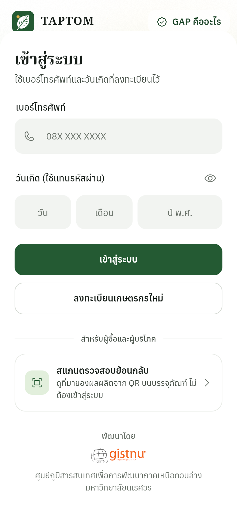
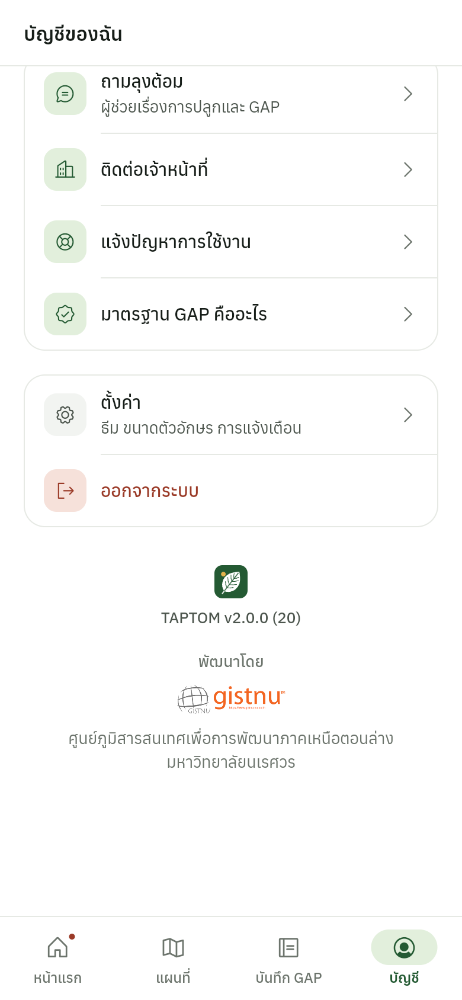

# TAPTOM Mobile

**Language: English** | [Thai (ไทย)](./README-th.md)


A centralized agricultural management app built with Flutter for kratom farmers and the government officers who certify them. Farmers keep their **GAP (Good Agricultural Practices)** records in one place, officers review and approve them, and every harvest lot can be traced back to its plot through a **QR code**.

<p align="center">
  
</p>

<p align="center">
  Developed by<br>
  <a href="https://www.gistnu.nu.ac.th/"></a><br>
  ศูนย์ภูมิสารสนเทศเพื่อการพัฒนาภาคเหนือตอนล่าง, Naresuan University
</p>

---

## Screenshots

### Farmer

| Home | Plot detail | GAP records | Harvest form |
| --- | --- | --- | --- |
|  |  |  |  |

| My plots map | Notifications | Ask Lung Tom | Public lot report |
| --- | --- | --- | --- |
|  |  |  |  |

### Officer and system administrator

| Officer home | GAP inspection | Members | Plots map |
| --- | --- | --- | --- |
|  |  |  |  |

| Administrator console | User trends | Officers | Dark theme |
| --- | --- | --- | --- |
|  |  |  |  |

### Credits in the app

| Login | Account | Certified plot |
| --- | --- | --- |
|  |  |  |

### Tablet and web

On wider screens the bottom bar becomes a navigation rail and content is centred.


The screenshots show the app running against a local copy of the TAPTOM backend, seeded with fictional members, plots and GAP records through its API, and were captured by `tool/screenshots` (see [docs/demo-mode.md](docs/demo-mode.md)). Map imagery was unavailable where they were taken, so the maps show the plain ground colour under the plot shapes.

---

## About The App

TAPTOM Mobile is an agricultural data platform that connects farmers with government officers through one app. It addresses real problems in Thai agriculture: farm records scattered across paper notebooks, no standard way to check quality, and no way to trace produce back to where it was grown.

Farmers register plots by drawing their boundaries on satellite imagery, record GAP data across the 7 standard categories, and create lot numbers for their harvests. Officers review submissions, approve plots and members, inspect GAP records and manage the farmers in their area. A system administrator manages the officers and sees the whole platform. Each role sees only what it is allowed to use.

---

## Key Features

### Sign-in and Security
- Phone number and birthday sign-in for every role (no password)
- Second step for staff: a 6-digit PIN for officers, 8 digits for administrators, set on first sign-in; three wrong PINs lock entry for five minutes
- JWT access and refresh tokens with a single shared refresh on 401
- Tokens kept in `FlutterSecureStorage` (EncryptedSharedPreferences on Android); the last user is cached so the app opens offline

### Plots and Maps
- **MapLibre GL** on satellite imagery (MapTiler with a key, Esri World Imagery without one)
- Boundary editor with undo, live area in rai, ngan and square wah, and a check for self-crossing edges
- All of a farmer's plots on one map with a card carousel; officers see every plot in their area, colour-coded by review state
- Plot photos for inspection evidence

### GAP Records (7 Categories)
- **1.1** General information (planting, variety, water source, irrigation)
- **1.2** Production inputs (fertilisers and chemicals with safety details)
- **1.3** Field management activities
- **1.4** Harvest (date, amount, quality grade)
- **1.5** Post-harvest handling (sorting, drying, packing, storage)
- **1.6** Hygiene and worker safety
- **1.7** Traceability lots: every harvest gets a lot number automatically, and officers can issue extra lots for split shipments
- Progress per plot with the next category to fill in; records become read-only once the plot is certified
- Drafts are kept on the device (SQLite on mobile) and the general form autosaves

### QR Traceability (Public)
- Scan a lot QR code or open its link to see the report, no account needed
- Shows the farmer, plot location and boundary, GAP status, chemicals used, harvests and post-harvest handling

### Role-Based Access
- **Farmer**: own plots, GAP records, certificates, notifications, help tickets
- **Officer**: approve members and plots, inspect GAP records with per-category feedback, draw plots for farmers, message other officers; actions are limited to plots inside the officer's territory
- **System administrator**: everything an officer can do anywhere, plus creating officers, assigning territories, moving members between officers, and the audit trail
- The router guard and the territory check mirror the server rules, so screens never offer an action that would be rejected

### Ask Lung Tom
- An assistant for questions about fertiliser, plant disease and GAP steps, with voice input (built-in sample answers when no Gemini key is set)
- Lung Tom, a farmer mascot drawn in code, greets on login, fills empty states and reacts while the assistant thinks

### Also Included
- GAP inspection report and certificate as PDF, with Thai fonts and partner logos bundled for offline use
- Notification centre, officer messaging and help tickets
- Light and dark themes, four text sizes, reduce-motion support
- GISTNU credited on the splash, login, account, settings, contact and public lot pages, and on certificates
- PDPA consent on sign-up

---

## Design

The 2.0 redesign replaced the earlier mix of gradients and downloaded fonts with a small design system:

- One brand colour (field green) on white, with amber, clay and slate used only for status
- Anuphan for the interface, Noto Serif Thai for titles and numbers, IBM Plex Mono for phone numbers and lot codes, all bundled
- Two GLSL fragment shaders: a field of ridgelines and swaying grass behind the login, and drifting contour lines in the dashboard headers, each with a painter fallback
- Responsive from small phones to desktop, with a navigation rail from 600 px

Details are in [docs/design-system.md](docs/design-system.md).

---

## Architecture

```
lib/
├── main.dart                 # Bootstrap: env, Thai date data, locator, shader warm-up
├── app/
│   ├── app.dart              # MaterialApp.router, providers, themes, text-scale clamp
│   ├── router.dart           # Every route and the role guard
│   ├── routes.dart           # Route names, role homes, role requirements
│   └── locator.dart          # GetIt registrations
├── core/
│   ├── config/               # Env: .env plus --dart-define overrides, demo flag
│   ├── design/               # Palette, type scale, spacing, motion, icons, theme
│   ├── effects/              # GLSL backdrops, Lung Tom mascot, logo
│   ├── network/              # ApiClient (Dio), endpoints, ApiException
│   │   └── demo/             # In-memory backend for demo builds
│   ├── security/             # Secure token storage
│   ├── services/             # One service per API area, plus PDF and cache helpers
│   ├── utils/                # Thai dates, status labels, map styles, geometry
│   └── widgets/              # Shared component library
├── data/models/              # Plain models with tolerant fromJson
└── features/
    ├── auth/                 # Login, sign-up, PIN entry and setup
    ├── home/                 # Farmer and staff dashboards, splash
    ├── map/                  # Plot map, plot detail, boundary editor
    ├── gap/                  # The seven GAP forms, overview, summary, gallery
    ├── traceability/         # Public lot report and QR scanner
    ├── admin/                # Members, plot review, messaging, audit trail
    ├── super_admin/          # Console, officers, officer detail
    ├── notifications/        # Notification centre
    ├── certificate/          # Certificate list and preview
    ├── chat/                 # Ask Lung Tom
    ├── support/              # Help tickets
    └── profile/, settings/, contact/
```

**Key architectural decisions:**
- **Feature-first layout**: each feature owns its screens and widgets; `core` holds what is shared and never imports a feature
- **Provider plus GetIt**: Provider for app-wide state in the widget tree, GetIt for singletons the network layer needs without a `BuildContext`
- **One API client**: Dio interceptors add the token, refresh it once on 401 for all waiting requests, retry 429 with backoff, and turn every failure into an `ApiException` with a Thai message
- **Demo backend as an interceptor**: demo builds answer requests from memory after the auth interceptor, so the real token and role logic still runs

More in [docs/architecture.md](docs/architecture.md).

---

## Tech Stack & Libraries

| Category | Library | Purpose |
|----------|---------|---------|
| **State** | `provider` | App-wide state with ChangeNotifier |
| | `get_it` | Service locator outside the widget tree |
| **Routing** | `go_router` | Declarative routes with the role guard |
| **Networking** | `dio` | HTTP client with interceptors |
| | `pretty_dio_logger` | Request logging in debug builds |
| | `flutter_dotenv` | `.env` configuration |
| | `http` | Gemini API calls for the assistant |
| **Maps & Location** | `maplibre_gl` | Satellite map, plot drawing and overlays |
| | `geolocator` | Device position |
| | `permission_handler` | Runtime permissions |
| **Security** | `flutter_secure_storage` | Encrypted token storage |
| **Local Storage** | `sqflite` | Offline GAP drafts |
| | `shared_preferences` | Settings and web drafts |
| **PDF** | `pdf` + `printing` | Certificates and inspection reports |
| | `share_plus` | Share sheet |
| **QR Code** | `mobile_scanner` | Camera QR scanning |
| | `qr_flutter` | Lot QR codes |
| **Voice** | `speech_to_text` | Voice questions for the assistant |
| **UI** | `phosphor_flutter` | Icon set |
| | `flutter_animate` | Entrance and state animations |
| | `fl_chart` | Dashboard charts |
| | `cached_network_image` | Photo caching |
| **Utilities** | `intl` | Thai dates and numbers |
| | `image_picker` | Camera and gallery |
| | `url_launcher`, `path_provider`, `package_info_plus`, `logger` | Links, files, version, logging |

---

## Getting Started

### Prerequisites

- Flutter SDK 3.38 or newer (Dart 3.10)
- Android Studio or Xcode for a device or emulator
- A running instance of the [TAPTOM Backend (NestJS)](https://github.com/putianan65/taptom-backend), or demo mode below

### Installation

```bash
# 1. Clone the repository
git clone https://github.com/putianan65/taptom-mobile.git
cd taptom-mobile

# 2. Create the environment file
cp .env.example .env
# Edit .env and set API_BASE_URL

# 3. Install dependencies
flutter pub get

# 4. Run the application
flutter run
```

### Demo Mode (no backend)

```bash
flutter run --dart-define=TAPTOM_DEMO=true
```

The app runs against built-in sample data, and the login screen offers one-tap farmer, officer and administrator accounts. See [docs/demo-mode.md](docs/demo-mode.md) for the accounts and PINs.

### Environment Variables

Create a `.env` file in the project root. Each value can also be passed with `--dart-define`, which takes precedence.

```env
API_BASE_URL=https://your-api-domain.com/api
MAPTILER_API_KEY=            # optional, Esri imagery is used without it
GEMINI_API_KEY=              # optional, the assistant uses sample answers without it
```

The `.env` file is bundled into the app, so any key in it can be read from the installed package. For production, call Gemini through the backend instead of shipping the key.

### Tests

```bash
flutter analyze
flutter test
```

---

## Backend Integration

This app connects to the **TAPTOM Backend** built with NestJS. The API client (`lib/core/network/api_client.dart`) handles:

- Bearer token on every request
- One refresh on 401 Unauthorized, shared by every request that is waiting for it
- Retry on 429 (rate limiting) with backoff
- Errors mapped to `ApiException` with Thai messages
- Connect and receive timeouts

Endpoints are listed in `api_endpoints.dart`, covering authentication, plots, GAP forms, traceability, officer operations, messaging, tickets and analytics. The Swagger export is in [docs/api](docs/api).

---

## Documentation

| Document | Contents |
| --- | --- |
| [docs/design-system.md](docs/design-system.md) | Colour, type, spacing, motion and components |
| [docs/architecture.md](docs/architecture.md) | Layout, state, networking, roles and routing |
| [docs/demo-mode.md](docs/demo-mode.md) | Running without a backend, sample accounts, screenshots |
| [docs/README.md](docs/README.md) | Index of everything in `docs/` |
